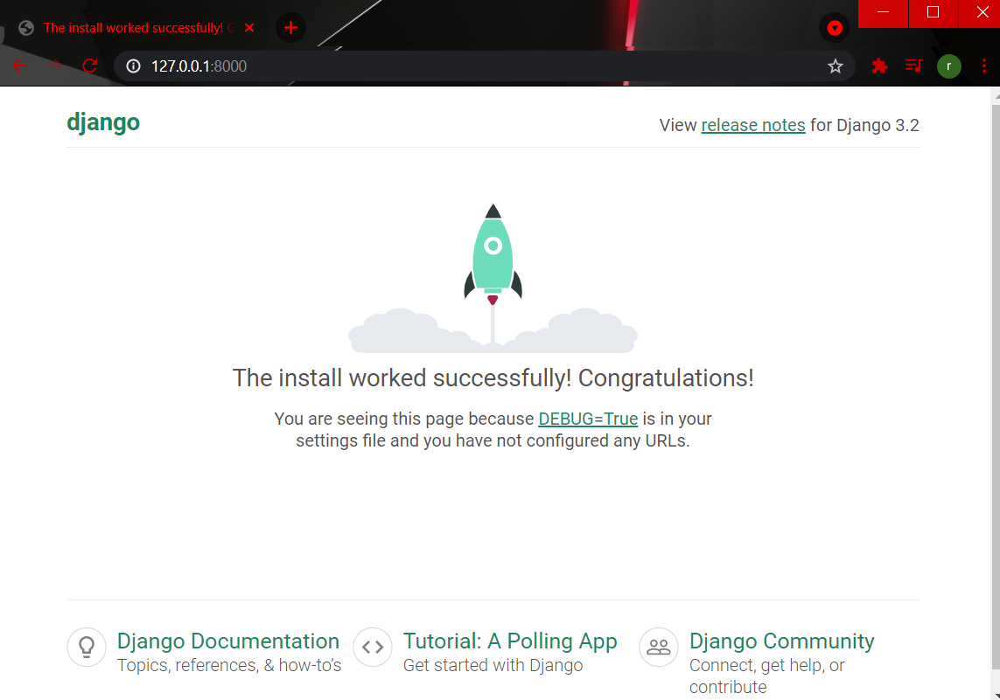

## Accessing students records using django rest api
### We are going to see how to create rest api in Python using django rest api


Create the project using below command
```
django-admin startproject project_name 

example: django-admin startproject student

```

Test it(project created successfully or not) using the below command 
```
python manage.py runserver

April 28, 2021 - 18:52:17
Django version 3.2, using settings 't.settings'
Starting development server at http://127.0.0.1:8000/
Quit the server with CTRL-BREAK.
```
Just copy-paste http://127.0.0.1:8000/ this any browser(Internet Explorer, Google Chrome, Mozilla Firefox ...)

You will see this 


Now, Create the app using the below command
```
python manage.py startapp app_name 

example: python manage.py startapp api

```

Now, list the app and rest_framework in setting.py file 

When you open you will see this
```
INSTALLED_APPS = [
    'django.contrib.admin',
    'django.contrib.auth',
    'django.contrib.contenttypes',
    'django.contrib.sessions',
    'django.contrib.messages',
    'django.contrib.staticfiles',
]
```
You must need to list app_name and rest_framework
```
INSTALLED_APPS = [
    'django.contrib.admin',
    'django.contrib.auth',
    'django.contrib.contenttypes',
    'django.contrib.sessions',
    'django.contrib.messages',
    'django.contrib.staticfiles',
    'rest_framework',
    'api',
]
```

Now open models.py and create your table
```
from django.db import models

# Create your models here.
class Student(models.Model):
    name = models.CharField(max_length=100)
    roll = models.IntegerField()
    school = models.CharField(max_length=100)
    address = models.CharField(max_length=100)
```

After creating table open admin.py file to list the table in admin panel 

```
from django.contrib import admin
from .models import Student

# Register your models here.
@admin.register(Student)
class StudentAdmin(admin.ModelAdmin):
    list_display = ['id','name','roll','school','address']
```

Open your terminal migrate the table into database 
```
python manage.py makemigrations
```
after that
```
python manage.py migrate
```
Note: if you change anything in the table please run **python manage.py migrate** command

Create superuser 
```
python manage.py createsuperuser
```
password(must) other(if your want)


Now again run the server
